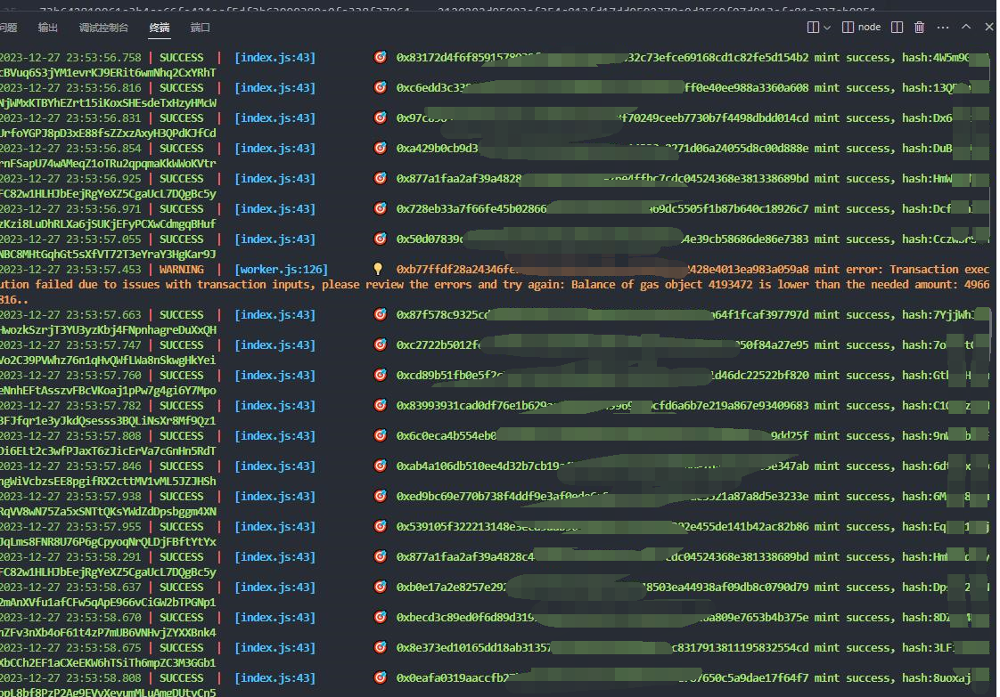
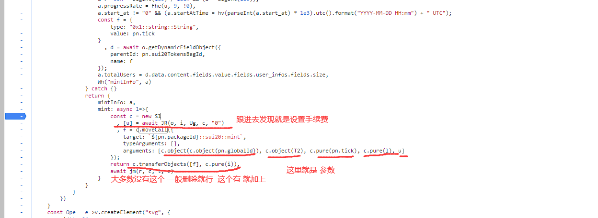

# suiProject

sui 链的打铭文的例子
本例子的网站 https://issp.io/#/sui20

## 运行截图



## 安装

项目目录下，运行以下命令来安装所需的依赖：

```bash
npm i
```

首先，您需要在 keys.txt 文件中输入相关的信息。请确保按照下面的格式添加您的信息（例如，地址、私钥等），一行一个：

```bash
0x53b99721eb**********132ad0a6
0xa5d67**********c4841dfe7e----0x53b99721eb**********132ad0a6
```

## 运行

然后，运行以下命令来启动程序：

```bash
node index.js
```

## 说明及修改

单账号单个进程同时运行

对于其他网站怎么搞
网站源代码中(f12) 搜索 `.movecall` 定位到 自己要写 bot 的地方 下断点
找到并替换 this.#trg = `0xd0ea9bc91c3855e9b58a51cd55e8455b37bd5c75f70b4d6e97e54b55c4ba4ae8::sui20::mint`;

```
const [l] = txb.splitCoins(txb.gas, [txb.pure(fee)]);
const f = txb.moveCall({
target: this.#trg,
arguments: [
    txb.object(
    txb.object(
        "0x0552767a0f3c11d86ad0e8fa78e7115f0fa1414cbec50e73be7565caada005f1"
    )
    ),
    txb.object(
    "0x0000000000000000000000000000000000000000000000000000000000000006"
    ),
    txb.pure("issp"),
    txb.pure("5000"),
    l,
],
typeArguments: [],
});
txb.transferObjects([f], txb.pure(this.#address));
```

根据网站 重点修改这里 看网站怎么写 就怎么改
这里是修改手续费的地方 没有就删除此段 有的话 就改下 fee 就行

```
const [l] = txb.splitCoins(txb.gas, [txb.pure(fee)]);
```

arguments 中的 就看网站怎么写就怎么写
下图 就是 网站中的例子

